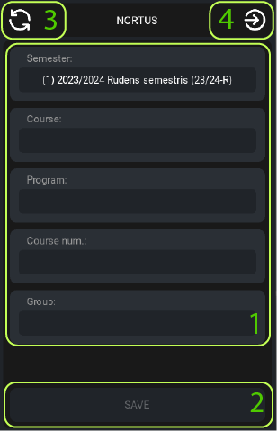
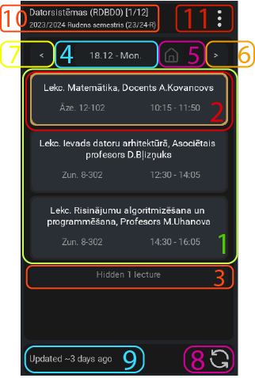
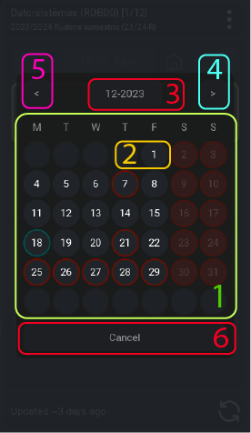
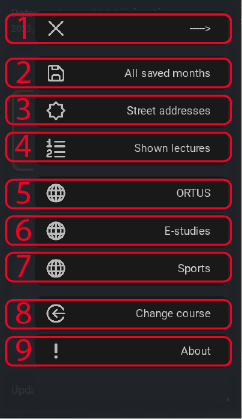
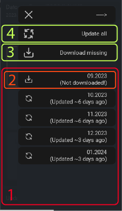
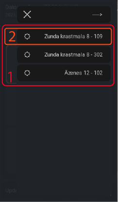
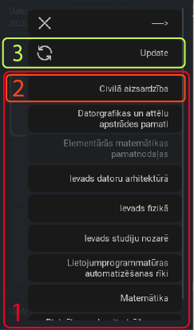

# Par programmu:
### Pamatinformācija:
* **Nosaukums:** NORTUS
* **Autors:** ValdisV - (Valdis Vilcāns 231RDB110)
* **Dokumentācija priekš versijas:** 1.0.0
* **Aplikācijas interfeisa valoda:** Angļu
* **Pirmā augšupielāde (*Initial commit*):** 21.11.2023
* **Nodarbību informācijas ieguves saite (*web scraped from*):** [*nodarbibas.rtu.lv*](https://nodarbibas.rtu.lv/)
* **Aplikācijā izmantotās ikonas:** [Unicons Font - Free User Interface Icon Pack](https://iconscout.com/free-icon-pack/user-interface-123)

### Mērķis:
* Programmas mērķis ir iegūt, saglabāt un vizuāli parādīt RTU nodarbību sarakstu, lietotāja izvēlētajam semestrim, programmai, kursam un grupai.

* Izstrādāt aplikāciju priekš skārienjūtīgiem telefoniem ar operētājsistēmu *Android*.

### Programmas tapšanas iemesli:
* Lai redzētu lekciju no nodarbību saraksta, man nākas veikt vairākus soļus (nākas ievadīt nepieciešamo informāciju), tas patērē daudz laika.

### Programmas funkcijas:
* Ļaut lietotājam izvēlēties semestri, programmu, kursu un grupu. No šīs informācijas aplikācija varēs iegūt nepieciešamos nodarbību sarakstus. *Šī informācija tiks saglabāta. Lietotājs var mainīt šo informāciju.*

* Atverot programmu, ir redzams šīs dienas nodarbību saraksts. Pie katras nodarbības ir tās nosaukums, adrese un laiks (no - līdz).
* Šībrīža un nākamā nodarbība tiek vizuāli izcelta, lai pievērstu uzmanību.
* Ļauj lietotājam atjaunināt nodarbību sarakstu jebkurā laikā.
* Lietotājs var paslēpt nodarbības, kuras uz viņu neattiecas.
* Lietotājam ir pieejams kalendāras. Caur kuru ir iespēja pārslēgties starp dienām. Ir paredzamas aizņemtās un brīvās dienas.

# Izmantotās bibliotēkas:
* ***kivy*** - izmantots priekš grafiskā interfeisa. Šī bibliotēkai atbalsta skārienjūtīgos telefoniem.

* ***requests*** - izmantots priekš informācijas ieguves no interneta saitēm.
* ***traceback*** - ļauj redzēt pilnu kļūdas kodu pat pēc *try/except* metodes izmantošanas.
* ***datetime*** - ļauj viegli modificēt un pārvietoties starp datumiem. Ļauj iegūt pašreizējās dienas datumu.
* ***calendar*** - izmatotos, lai mēneša dienas iegūtu, saraksta veidā.
* ***functools*** - izmantots priekš *decorator* funkcijas, lai nepazaudētu oriģinālās funkcijas informāciju, u.t.t.. 
* ***threading*** - ļauj veikt paralēlus procesus. Izmantots informācijas ieguves posmā no interneta, lai neapstādinātu galveno procesu.
* ***beautifulsoup4 "bs4"*** - izmantos, lai viegli pārvietotus un meklētu informāciju *HTML*** skriptā.
* ***webbrowser*** - ļauj atvērt interneta saiti pārlūkprogrammā.
* ***os*** - ļauj pārlūkot aplikācijas saglabātos failus, veidot mapes, u.t.t..
* ***itertools*** - izmantots kalendāram, lai apvienotu pogas ar dienām vienā ciklā.
* ***json*** - izmantots, lai rakstītu un lasītu *.json* tipa failus.

# Programmas izmantošanas metodes:
*Katra loga apraksta bildē ir ievilkti taisnstūri ar cipariem. Katrs taisnstūris ieskauj objektus, kuru nozīme tiek izskaidrota zem bildes.*

## 1. logs - informācijas ievadīšana
Šajā logā lietotājam ir jāatlasa prasītā informācija, lai programma varētu atrast un iegūt nepieciešamās nodarbības.

1. Katrā no laukiem ir jāatlasa prasītā informācija. *Visa informācija ir jāatlasa secīgi.*

2. Saglabā atlasīto informāciju. *Visi 1. punkta logi ir jāatlasa, lai saglabātu.*
3. Atjaunina informāciju no interneta. *Katru reizi atverot šo logu, informācija tiek atjaunotu automātiski. Šo pogu ir ieteicams izmantot tikai ja logs ir bijis atvērts ilgstoši.*
4. Pāreja uz **2. logu**. *Poga parādās, ja informācija ir saglabāta vismaz vienu reizi.*

## 2. logs - nodarbību saraksts
Šajā logā tiek parādīts atlasītās dienas nodarbību saraksts. *Atverot aplikāciju programmu automātiski rāda pašreizējās dienas nodarbības. Ja šī diena iekrīt brīvdienā un šajā dienā nav ieplānotas nodarbības, programma automātiski pāriet uz nākamo pirmdienu.*

1. Parāda atlasītās dienas nodarbību sarakstu.

2. Nodarbība. *Ja tiek parādīta šībrīža diena tad, nodarbības var tikt parādītas ar dažādām apmales krāsām, atkarībā no laika (zaļa = šobrīd notiek, gaiši brūna = nākošā).*
3. Parāda paslēpto nodarbību skaitu. Uzspiežot tiks parādītas paslēptās nodarbības.
4. Vizuāli parāda atlasītās dienas datumu *dienu, mēnesi un dienas nos.*. Uzspiežot tiks atvērts **kalendāra logs**.
5. Uzspiežot atiestatīs dienu.
6. Uzspiežot pāries uz nākamo dienu.
7. Uzspiežot pāries uz iepriekšējo dienu.
8. Uzspiežot atjaunina atlasītās dienas mēneša nodarbības.
9. Parāda, pirms cik ilga laika tika atjaunināts atlasītās dienas mēnesis.
10. Parāda programmu, kursu, grupu un semestri.
11. Uzspiežot tiks atvērts **izvēlnes logs**.

## 3. Kalendāra logs
Caur kalendāru var pārskatīt visa semestra dienas.

1. Tiek parādīts kalendārs ar visām mēneša dienām.

2. Uzspiežot uz dienas tev tiks parādīts tās nodarbību grafiks 2.logā. *Apmaļu krāsu nozīme: zaļa = atlasītā diena, sarkana = brīva diena.*
3. Parāda kalendāra mēnesi un gadu. Uzspiežot atiestatīts datumu (pāries uz jau atlasītās dienas datumu).
4. Uzspiežot pāries uz nākamo mēnesi.
5. Uzspiežot pāries uz iepriekšējo mēnesi.
6. Uzspiežot tiks aizvērs kalendāra logs.

## 4. Izvēlnes logs

Pogas:
1. Aizvērt izvēlnes logu.
2. Atver **visu mēnešu izvēlni**
3. Atver **adrešu izvēlni**
4. Atver **parādīto nodarbību izvēlni**
5. Atver interneta pārlūkā: **[ortus.rtu.lv](https://ortus.rtu.lv)**
6. Atver interneta pārlūkā: **[estudijas.rtu.lv](https://estudijas.rtu.lv)**
7. Atver interneta pārlūkā: **[rtu.lv/lv/sports/sporta-nodarbibas/pieteikties-nodarbibam](https://www.rtu.lv/lv/sports/sporta-nodarbibas/pieteikties-nodarbibam)**
8. Atver **1. logu**
9. Atver **info izvēlni**

## 5. Izvēlnes logs - visu mēnešu izvēlne
Caur šo logu var pārskatīt visus semestra mēnešus, tos nolādēt un atjaunināt.

1. Parāda visa semestra mēnešus.
2. Parāda, kad un vai mēneša nodarbība ir nolādēta. Uzspiežot tiek iegūts jaunākais mēneša nodarbību saraksts.
3. Uzspiežot nolādē visus nenolādētos mēnešus.
4. Uzspiežot atjaunina visus jau nolādētos mēnešus.

## 6. Izvēlnes logs - adrešu izvēlne
Caur šo logu var pārskatīt 2. logā parādīto nodarbību pilnās adreses un tās nokopēt.

1. Parāda atlasītās dienas nodarbību adrešu pilnos nosaukumus.
2. Uzspiežot uz adreses tā tiks nokopēta.

## 7. Izvēlnes logs - parādīto nodarbību izvēlne
Caur šo logu var paslēpt nodarbības, kuras neattiecās uz lietotāju.

1. Parāda visas lekcijas.
2. Uzspiežot nodarbība tiks paslēpta nodarbību sarakstā. *Atkārtoti uzspiežot, nodarbība vairs netiks paslēpta.*
3. Uzspiežot atjaunina nodarbību sarakstu no interneta. *Atjauninot mēnešus, nodarbību saraksts netiek atjaunināts.*

## 8. Izvēlnes logs - info izvēlne
Šajā logā tiek parādīta informācija 1.logā atlasīto informāciju un informācija par pašu aplikāciju.
